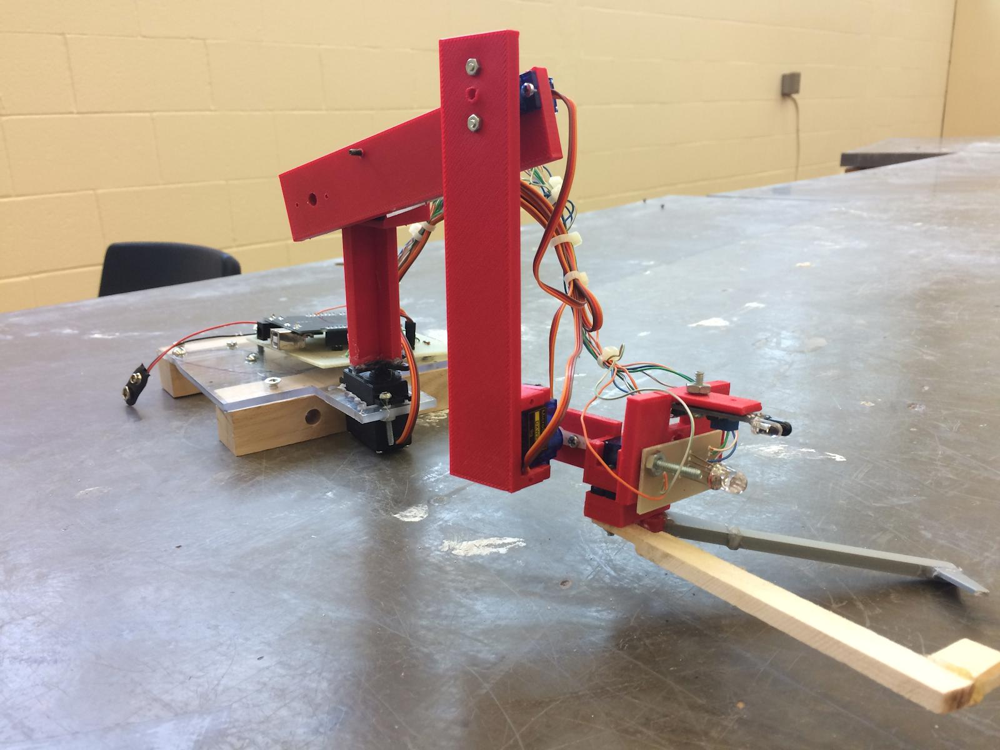
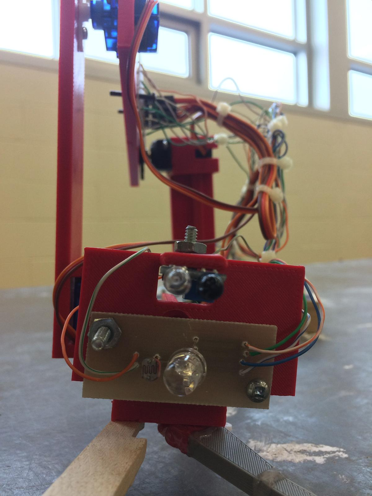
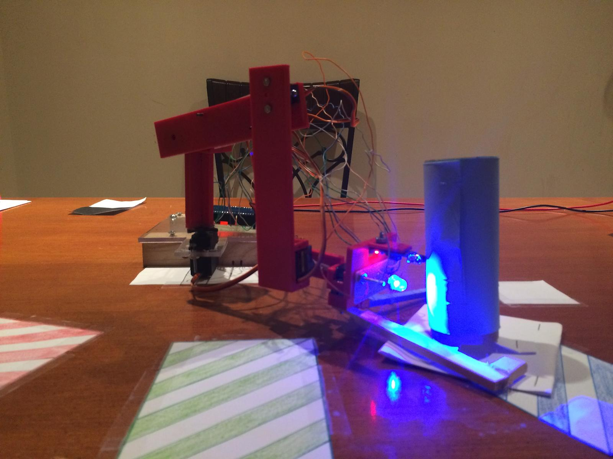

# Robot_Arm

## The Green Arm

It is a 5-servo robotic arm, powered by an Arduino with a colour sensor and detectors, to intelligently locate a coloured barrel, pick it up and configure its colour, and place it onto its designated zone.

A few key features to point out are the colour sensor and design.
* The project contained a simple colour sensor that uses a CdS photocell and RGB diode to gather information on different wavelengths reflected by the surface each barrel when red, blue, and green were shown on the part. I coded an algorithm to gather data over a set number of samples and determine the most prominent colour seen. This elminated the need of prebuild colour sensor, reducing project cost by 20\% 
* The project was designed using AutoCAD online 3D modelling software, and all parts of the base model were printed to assemble the robot. The arm was able to rotate about a semi circle and raech out and grab a barell

### Closeup View of Colour Sensor

### Functioning Arm

The code and project writeup can be found in the [project writeup](https://github.com/wshahbaz/Green_Arm/blob/master/Green%20Arm%20Informational%20Report.pdf)

Note that this project was inspired by [IBM's Green Arm Challenge](http://www.orc.ieeeottawa.ca/green-arm-challenge/). It has nothing to do with the colour of the robot :)
